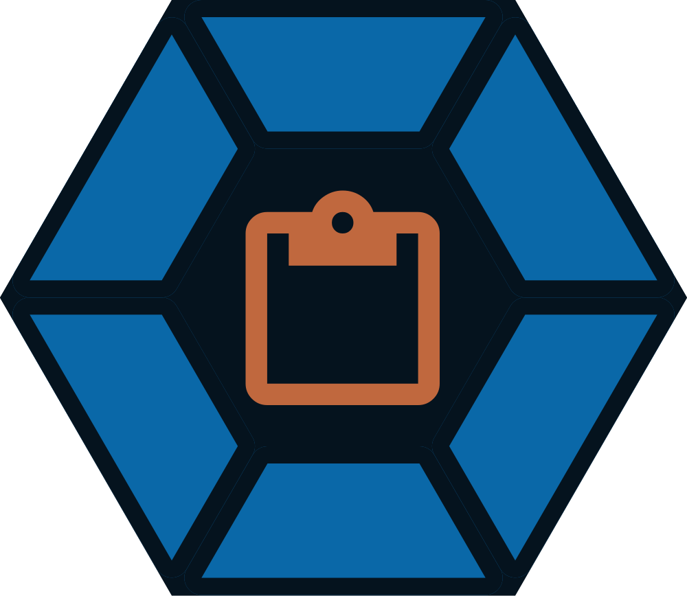

<p align="center">
  
</p>

<h1 align="center">Stowaway</h1>

**Stowaway** is a lightweight Wayland clipboard manager and emoji/character picker overlay for the **AstraSuite** ecosystem, built with Qt 6 and QML.

## Features

- Dynamic cursor-anchored overlay with boundary clamping and edge flipping
- Rich clipboard history with auto-categorization (Text, Code, URLs, Colors, Images)
- Persistent JSON storage with pinning support
- Unicode emoji picker with fuzzy search
- Kaomoji and Unicode symbol pickers
- Auto-paste via `wtype`
- Material 3 Expressive UI with Caelestia color palette integration

## Dependencies

### Build

- C++20 compiler (GCC 11+ or Clang 14+)
- CMake 3.19+
- Ninja
- pkg-config
- Qt 6.5+ (Core, Qml, Quick, QuickControls2, QuickEffects, Svg)

### Runtime

- `qt6-base`, `qt6-declarative`, `qt6-svg`
- `quickshell`
- `wtype` (for auto-paste)

### Optional

- `caelestia-cli`: dynamic color palette and accent syncing

## Installation

### Arch Linux / AUR

```bash
# Release (builds from source)
paru -S astra-stowaway

# Latest git development
paru -S astra-stowaway-git
```

### Manual Installation (From Source)

```bash
cmake -B build -S . -DCMAKE_BUILD_TYPE=Release
cmake --build build
sudo cmake --install build
```

This installs the `stowaway` binary to `/usr/bin/stowaway`.

## Usage

```bash
stowaway --toggle        # Toggle clipboard overlay anchored beside cursor
stowaway --emoji         # Open the emoji picker
stowaway --kaomoji       # Open the kaomoji picker
stowaway --symbols       # Open the symbols picker
stowaway --clear         # Clear unpinned clipboard history
stowaway --daemon        # Run background daemon
```

### Hyprland Animations

Add to `~/.config/caelestia/hypr-user.lua`:

```lua
hl.layer_rule({
    match = {
        namespace = "stowaway",
    },
    no_anim = true,
})

```

## Credits and Licensing

This project is licensed under the GNU General Public License v3.0 (GPLv3).

Stowaway incorporates design tokens, QML components, and styling derived from [Caelestia Shell](https://github.com/caelestia-dots/shell).
